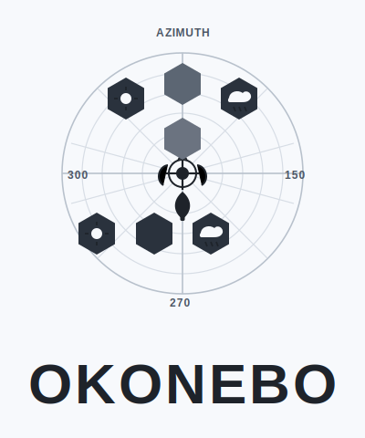

# OkoNebo

[](https://github.com/thezolon/OkoNebo/actions/workflows/ci.yml)



OkoNebo is a self-hosted weather dashboard and local API for your location. It combines current conditions, alerts, 7-day forecast, hourly trend, radar, PWS data, aviation METAR, and coastal tide predictions in one Docker service.

This project is also a personal demonstration of AI-assisted software development — designed, built, and iterated on with [GitHub Copilot](https://github.com/features/copilot) as an active collaborator throughout the full development lifecycle.

## Features

- **Multi-provider fallback** - NWS -> WeatherAPI -> Tomorrow.io -> Visual Crossing -> Meteomatics; first successful response wins
- **Keyless providers** - NWS, AviationWeather (METAR), NOAA Tides start without any API key
- **First-run blocking overlay** - fresh installs prompt for location and optional API keys before the dashboard loads
- **Encrypted settings store** - provider keys are stored in a Fernet-encrypted SQLite database, never in plain text on disk
- **Optional authentication** - JWT-based login with admin and viewer roles; login rate limiting (10 attempts / 5 min / IP); token revocation on logout
- **In-app Setup panel** - edit location, timezone, providers (with per-provider pull cycles), authentication, and manage AI agent tokens without restarting; unsaved changes detection with Ctrl+S save shortcut
- **Offline-aware UI** - persistent browser cache, last-known-good state, visible diagnostics
- **Responsive design** - compact/expanded panel layouts, touch-optimized mobile UX, orientation-aware rendering (Shift+C to toggle layout)
- **Event timeline** - searchable/filterable event log with category filters (Observations, Alerts, Refreshes, System events)
- **Admin observability** - real-time request/response metrics, error tracking, server connection monitoring, and operational health dashboard
- **Radar** - RainViewer with OWM overlay option; Esri/OSM/CARTO base layers
- **PWS** - personal weather station comparison and trend chart
- **CI pipeline** - compile checks, unit tests (35), Bandit security scan, Docker build + health + smoke on every push

## Quick Start

If your clone predates runtime DB bind mounts, run one clean restart once:

```bash
docker compose down
docker compose up -d --build
```

### 1. Copy the example config

```bash
cp config.yaml.example config.yaml
# Edit config.yaml and set lat/lon to your location
```

### 2. Start with Docker

```bash
docker compose up -d --build
bash health-check.sh
```

Windows (PowerShell):

```powershell
docker compose up -d --build
.\health-check.ps1
```

### 3. Open the UI

Open **http://localhost:8888**. On a fresh install, you will get a first-run setup screen for location and optional provider keys. Save once, and the dashboard starts loading live data.

For a complete step-by-step guide see [INSTALL.md](INSTALL.md).

| URL | Purpose |
|-----|---------|
| http://localhost:8888 | Dashboard |
| http://localhost:8888/docs | Swagger UI |
| http://localhost:8888/openapi.json | OpenAPI spec |
| http://localhost:8888/api/debug | Runtime diagnostics |

### Raspberry Pi

```bash
# Full deployment guide (recommended):
cat RASPBERRY_PI_DEPLOYMENT.md

# Quick start on a Pi host:
bash deploy-on-pi.sh
```

## Configuration

Copy [config.yaml.example](config.yaml.example) to `config.yaml`. The only required fields are `lat` and `lon`.
Most settings can also be changed later in the in-app Setup panel with no restart.

### Environment variables (optional)

Copy `.env.example` to `.env` before starting:

| Variable | Purpose |
|----------|---------|
| `AUTH_ENABLED` | `true` to require login (default: `false`) |
| `ADMIN_USERNAME` / `ADMIN_PASSWORD` | Admin credentials when auth is on |
| `VIEWER_USERNAME` / `VIEWER_PASSWORD` | Read-only viewer credentials (optional) |
| `SETTINGS_ENCRYPTION_KEY` | Fernet key for `secure_settings.db` (auto-generated if absent) |
| `WEATHERAPI_KEY` | WeatherAPI.com key |
| `TOMORROW_KEY` | Tomorrow.io key |
| `VISUALCROSSING_KEY` | Visual Crossing key |
| `OPENWEATHER_KEY` | OpenWeather One Call 3.0 key |
| `METEOMATICS_API_KEY` | `username:password` from Meteomatics |

## API Endpoints

| Endpoint | Description |
|----------|-------------|
| `GET /api/config` | Location and integration availability |
| `GET /api/current` | Current conditions (multi-provider fallback) |
| `GET /api/forecast` | 7-day forecast (multi-provider fallback) |
| `GET /api/hourly` | 48-hour hourly data (multi-provider fallback) |
| `GET /api/alerts` | Active NWS alerts for monitored locations |
| `GET /api/metar` | Latest aviation METAR (AviationWeather, keyless) |
| `GET /api/tides?days=1` | Tide predictions (NOAA CO-OPS, keyless) |
| `GET /api/owm` | OpenWeather supplemental data |
| `GET /api/pws` | Personal weather station observations |
| `GET /api/pws/trend?hours=3` | PWS trend points |
| `GET /api/stats` | Upstream call counts per provider |
| `POST /api/settings` | Save runtime settings (admin only when auth on) |
| `POST /api/auth/login` | Obtain JWT (rate-limited: 10 attempts / 5 min / IP) |
| `POST /api/auth/logout` | Revoke current token |
| `GET /api/debug` | Server/runtime diagnostics |
| `GET /api/support-bundle` | Safe-to-share redacted diagnostics bundle |
| `GET /api/bootstrap` | First-run completion state |

## Providers

| Provider | Type | Key required | Capabilities |
|----------|------|-------------|--------------|
| NWS | keyless | no | current, forecast, hourly, alerts |
| AviationWeather | keyless | no | METAR |
| NOAA Tides | keyless | no | tide predictions |
| WeatherAPI | keyed | yes | current, forecast, hourly |
| Tomorrow.io | keyed | yes | current, forecast, hourly |
| Visual Crossing | keyed | yes | current, forecast, hourly |
| OpenWeather | keyed | yes | current supplemental |
| Meteomatics | keyed | yes (`user:pass`) | current |

Keyless providers are enabled by default. Keyed providers activate automatically when their key is present.

## Development and Testing

### Local test harness

```bash
bash scripts/test_harness.sh
```

Runs: compile checks -> unit test suite (60 tests) -> Docker build -> health check -> integration smoke -> frontend smoke -> secret leak check.

```bash
# Skip Docker (test against an already-running container):
HARNESS_SKIP_DOCKER=1 bash scripts/test_harness.sh

# Point at a different host:
WEATHERAPP_BASE_URL=http://myhost:8888 bash scripts/test_harness.sh
```

### Continuous Integration

The CI pipeline (`.github/workflows/ci.yml`) runs on every push and PR to `main` and `release/**`:

- **test job**: compile checks, markdown link check, Python unit test discovery (60 tests), Bandit security scan
- **docker job**: build image, health check, integration smoke

## Operations Notes

- Weather endpoints can return `502` before setup is completed or when all providers fail. That is expected behavior, not a crash.
- The browser stores a last-known-good state so the UI can recover after reloads or brief outages.
- Frame-cache cleanup runs automatically and keeps browser storage bounded.
- Docker build context is trimmed via `.dockerignore`; local virtualenv and editor files do not end up in the image.
- Login brute-force protection: 10 failed attempts in a 5-minute window locks the IP until the window resets.
- The test alert defaults to off.

## Files Worth Knowing

| File | Purpose |
|------|---------|
| [app/main.py](app/main.py) | FastAPI routes, auth, orchestration |
| [app/weather_client.py](app/weather_client.py) | All upstream HTTP clients and normalizers |
| [app/static/js/app.js](app/static/js/app.js) | Frontend state, rendering, first-run overlay |
| [app/static/index.html](app/static/index.html) | Dashboard layout |
| [app/static/css/style.css](app/static/css/style.css) | Styling |
| [config.yaml.example](config.yaml.example) | Annotated configuration template |
| [ARCHITECTURE.md](ARCHITECTURE.md) | System design, provider matrix, auth notes |
| [docs/implementation.md](docs/implementation.md) | Technical implementation notes |
| [SECURITY.md](SECURITY.md) | Security policy and reporting |
| [CONTRIBUTING.md](CONTRIBUTING.md) | Contribution guide |
| [RASPBERRY_PI_DEPLOYMENT.md](RASPBERRY_PI_DEPLOYMENT.md) | Pi deployment notes |

## Troubleshooting

### Health check

```bash
bash health-check.sh
```

Weather data endpoints (`/api/current`, `/api/forecast`, `/api/hourly`, `/api/alerts`) report `OK (502)` on a fresh install with no location configured - this is correct. Configure your location through the first-run overlay or Setup panel to get live data.

### Debug payload

```bash
curl http://localhost:8888/api/debug
```

### Safe support bundle

```bash
python scripts/support_bundle.py
```

For auth-enabled installs:

```bash
OKONEBO_BEARER_TOKEN=<token> python scripts/support_bundle.py --base-url http://localhost:8888
```

Expected result: a timestamped `support_bundle_*.json` file you can share for troubleshooting without exposing configured keys or passwords.

### Provider statistics

```bash
curl http://localhost:8888/api/stats
```

### Secret leak check

```bash
python scripts/security_check.py
```

Expected: `SECRET LEAK CHECK: OK`

### Rebuild container

```bash
docker compose up -d --build
```

### Recover admin access (Docker)

If auth is enabled and admin credentials are lost, reset them without wiping app state:

```bash
docker exec okonebo python /app/scripts/reset_admin.py \
	--username admin \
	--password 'change-me-now-strong'
```

Then log in via `/admin.html` and rotate credentials immediately.

### Backup runtime state

```bash
bash scripts/backup.sh
```

Windows (PowerShell):

```powershell
.\backup.ps1
```

### Verify OpenWeather key is active

```bash
curl -s http://localhost:8888/api/owm
```

Success signals: UI `OWM` source badge is green; `/api/owm` contains populated `current`, `hourly`, and `daily`.

Not-ready signals: `/api/owm` returns `{"available": false, "error": "..."}` or `401 Unauthorized` - confirm One Call 3.0 is enabled on the OWM account, then rebuild/restart.

## Documentation

Feature guides live in the [docs/](docs/) folder:

| Guide | Topic |
|-------|-------|
| [docs/api-reference.md](docs/api-reference.md) | Complete endpoint reference |
| [docs/authentication.md](docs/authentication.md) | JWT login, roles, rate limiting, session tokens |
| [docs/agents.md](docs/agents.md) | AI agent tokens, scopes, discovery, MCP/REST integration |
| [docs/webhooks.md](docs/webhooks.md) | Outgoing webhooks on threat-level transitions |
| [docs/push-notifications.md](docs/push-notifications.md) | Browser push notifications for severe weather alerts |
| [docs/home-assistant.md](docs/home-assistant.md) | Home Assistant sensor and weather entity integration |
| [docs/multi-location.md](docs/multi-location.md) | Monitoring multiple locations simultaneously |
| [docs/support-troubleshooting.md](docs/support-troubleshooting.md) | Debug, support bundle, health checks, common errors |

## Contributing

See [CONTRIBUTING.md](CONTRIBUTING.md) and [CODE_OF_CONDUCT.md](CODE_OF_CONDUCT.md).
Security issues: see [SECURITY.md](SECURITY.md) for the responsible disclosure process.

## License

[MIT](LICENSE)

## Attribution

- [NOAA National Weather Service](https://www.weather.gov/) - public domain weather data
- [AviationWeather.gov](https://www.aviationweather.gov/) - public domain METAR data
- [NOAA CO-OPS](https://tidesandcurrents.noaa.gov/) - public domain tide predictions
- [OpenWeather](https://openweathermap.org/)
- [RainViewer](https://www.rainviewer.com/)
- [Leaflet](https://leafletjs.com/)
- [Chart.js](https://www.chartjs.org/)
- [GitHub Copilot](https://github.com/features/copilot) - AI pair programmer; this project wouldn't have gotten this far without it
